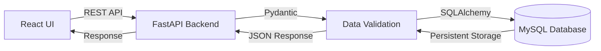
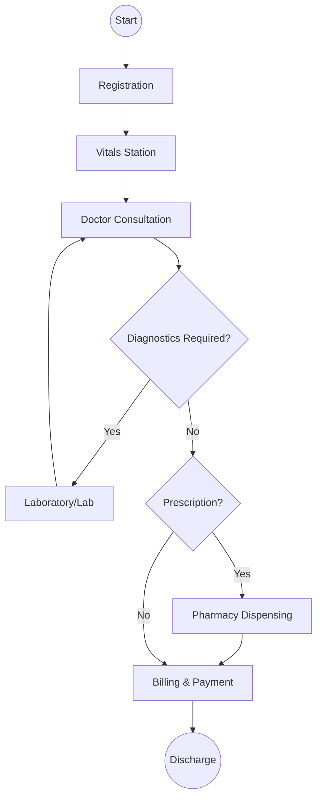

# AuraMed - Clinic Management System

A documentation-driven, premium clinic management platform designed for modern healthcare facilities. **AuraMed** handles the complete patient lifecycle, from registration and consultations to pharmacy dispensing and automated billing.

---

## Key Features

- **Patient Management & EMR**: Registration, demographic tracking, and a comprehensive Electronic Medical Record (EMR) system.
- **Clinical Consultations**: Vitals tracking (BP, Glucose, BMI), and clinical notes with detailed diagnosis recording.
- **Pharmacy CRM & Inventory**: Drug categorisation, inventory tracking, and full prescription fulfillment workflows.
- **Specialized Diagnostics**: Support for lab investigation requests, findings recording, and medical recommendations.
- **Automated Billing**: Seamless invoice generation triggered by clinic visits, with integrated Paystack payment processing.
- **Role-Based Access Control (RBAC)**: Secure, permission-based access for Doctors, Pharmacists, Admins, and Receptionists.
- **Appointments & Scheduling**: Real-time doctor assignment and scheduled visit management.
- **Reports & Analytics**: Data-driven insights into clinic activities and financial performance.

---

## Tech Stack

### **Backend**
- **Framework**: FastAPI (Python 3.12+)
- **Database**: MySQL (MariaDB) with SQLAlchemy ORM
- **Package Manager**: `uv` (Fast & Modern)
- **Validation**: Pydantic v2
- **Authentication**: JWT-based security with bcrypt hashing

### **Frontend**
- **Framework**: React 19 + TypeScript
- **Bundler**: Vite
- **Styling**: Tailwind CSS (v4)
- **State Management**: TanStack Query (React Query)
- **Icons**: Lucide React

---

## System Architecture & Data Flow

### **Architecture**
AuraMed follows a decoupled client-server architecture. The **FastAPI Backend** acts as a centralized RESTful API service, while the **React Frontend** provides a responsive, high-performance user interface.

### **Data Flow**


---

## Queue Flow (Patient Journey)

The clinical workflow is designed as a structured "Queue," guiding patients through each department:



---

## Installation Procedures

### **Root Project**
The repository uses a workspace structure managing both `backend` and `frontend`.

### **Backend Setup**
1. Navigate to the backend directory:
   ```bash
   cd backend
   ```
2. Install dependencies:
   ```bash
   uv sync
   ```
3. Initialize the database and seed demo data (optional):
   ```bash
   uv run python app/seed_demo.py
   ```
4. Start the server:
   ```bash
   uv run uvicorn app.main:app --reload
   ```

### **Frontend Setup**
1. Navigate to the frontend directory:
   ```bash
   cd frontend
   ```
2. Install dependencies:
   ```bash
   npm install
   ```
3. Start the dev server:
   ```bash
   npm run dev
   ```

---

## Documentation & API

- **Interactive API Docs**: Once the backend is running, visit `http://localhost:8000/` to access the Swagger UI.
- **API Version**: `v1`
- **Postman Support**: Postman collections can be generated by importing the `openapi.json` from the Swagger docs.

---

## Deployment & Branching Strategy

### **Branching Strategy**
We follow a feature-branching workflow to ensure stability:
1. **Create Feature Branch**: `git checkout -b feature/your-feature-name`
2. **Commit & Push**: Develop and push your changes.
3. **Pull Request (PR)**: Raise a PR against the `main` branch.
4. **Merge & Deploy**: Upon approval, merge the PR into `main` for deployment.

### **GitHub Repository**
- **URL**: [https://github.com/Chi-G/auramed.git](https://github.com/Chi-G/auramed.git)

